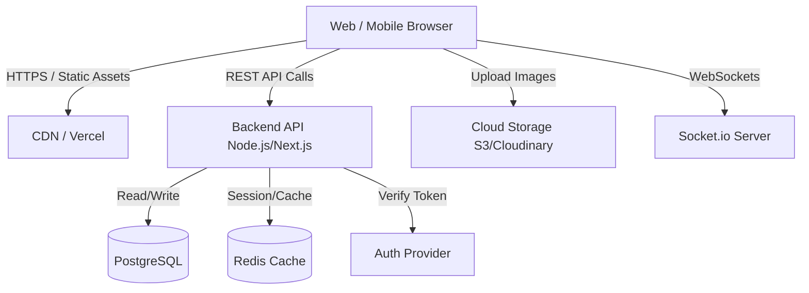

# AksharSetu - System Architecture

A modular, scalable architecture is essential for a marketplace application like AksharSetu. Below is the proposed high-level architecture.

## 1. High-Level Overview
The system will follow a **Client-Server Architecture** utilizing a **RESTful API** (or GraphQL) for communication between the frontend and backend.

## 2. Core Modules
### A. User Service
- Registration, Login, Profile Management.
- Maintains user stats, ratings, and "Vidya Daan" leaderboards.

### B. Catalog / Listing Service
- CRUD operations for book listings.
- Handles standard book data (Title, ISBN, Author) and listing specifics (Condition, Price, Images, Location).
- Location-based filtering (PostGIS extension in PostgreSQL can be used for geospatial queries).

### C. Search & Discovery
- Full-text search on book titles and authors.
- Filtering by genre, price, condition, and distance.
- Wishlist matching system.

### D. Chat Service
- Isolated real-time messaging microservice.
- Stores chat history securely.

### E. Notification Service
- Email (SendGrid/Amazon SES) and Push Notifications.
- Triggers alerts for Wishlist matches, chat messages, and transaction updates.

## 3. Data Flow Example: Listing a Book
1. User scans ISBN -> Frontend requests book details from external API (Google Books API).
2. User uploads photos -> Direct upload to Cloudinary/S3, returns image URLs.
3. User sets price/donation and location -> Submits form.
4. Backend API validates data -> Saves to PostgreSQL database.
5. Notification Service checks if this book matches any user's Wishlist -> Sends Email/Alert.
